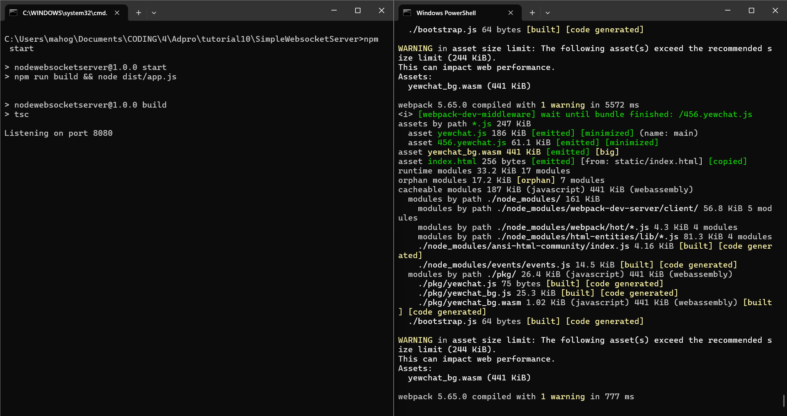
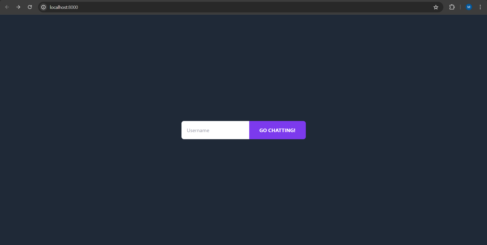
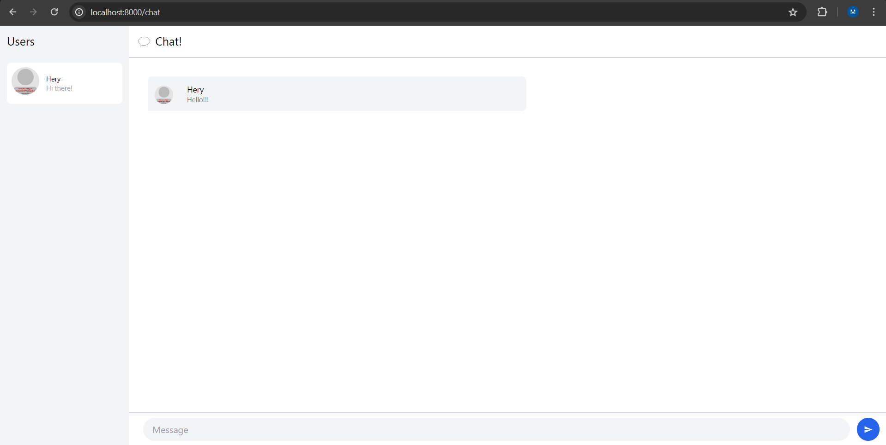
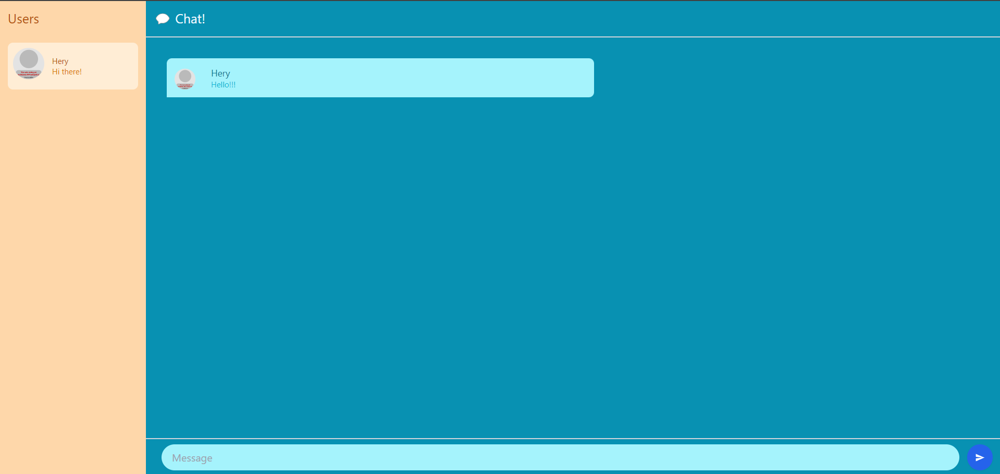

# advprog-modul10-YewChat

# Mahoga Aribowo Heryasa

# 2206025230

### Experiment 3.1: Original code

Terminal Run

Login Page

Chat Page

### Experiment 3.2: Be Creative!

Login Page

Chat Page

Explanation: untuk bagian *Be Creative!* saya mengubah tema dan skema warna dari *login page* dan *chat page*. Hal ini saya lakukan dengan merubah file html yang di-*return* pada `chat.rs` dan `login.rs`, serta memanfaatkan atribut *color class* yang disediakan tailwind. 